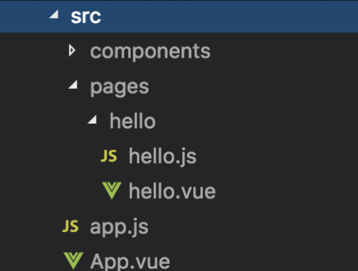

# 代码结构

## 基本原理

megalo 在执行编译命令后会将工程文件编译成[小程序的代码结构](https://developers.weixin.qq.com/miniprogram/dev/quickstart/basic/file.html)，此处以微信小程序为例，输出 `JSON 配置`、`WXML 模板`、`WXSS 样式文件`和 `JS 逻辑交互文件`。在 JS 执行时创建 vue runtime，通过 VNode 管理工程结构，调用微信小程序的 `setData` 将数据交由 `WXML 模板` 展示。

## megalo 代码结构

我们在 cli 构建的项目中看到，Megalo 的工程结构同传统的 vue 工程基本相同，只不过暂不支持 router 所以每页都是一个 vue 的实例。

每个单页由三种文件组成：

1. `.js` 为后缀的 entry 文件
2. `.vue` 为后缀的业务源码文件
3. 其他文件，`/components` 这类文件，也就是次要文件

 

接下来我们分别看看这4种文件的作用。

## entry 文件

entry 文件有两种，一种是 `/src` 下的 `app.js` 工程主文件和 `/src/pages` 下的 `hello/hello.js` page entry 文件，两种文件在功能和结构上都是很相似的。

以 `app.js` 工程主文件为例：

```js
import App from './App'
import Vue from 'vue'
import VHtmlPlugin from '@megalo/vhtml-plugin'
Vue.use(VHtmlPlugin)
const app = new Vue(App)
app.$mount()

export default {
  config: {
    // 页面前带有 ^ 符号的，会被编译成首页，其他页面可以选填，我们会自动把 webpack entry 里面的入口页面加进去
    pages: [
      'pages/hello/hello'
    ],
    window: {
      backgroundTextStyle: 'light',
      navigationBarBackgroundColor: '#fff',
      navigationBarTitleText: 'test',
      navigationBarTextStyle: 'black'
    }
  }
}
```

`app.js` 在执行编译命令后会由 megalo 编译生成两个文件 `JSON 配置文件`和 `JS 逻辑交互文件`，

```json
{
  "pages": [
    "pages/hello/hello"
  ],
  "window": {
    "backgroundTextStyle": "light",
    "navigationBarBackgroundColor": "#fff",
    "navigationBarTitleText": "test",
    "navigationBarTextStyle": "black"
  }
}
```

```js
require('./static/js/vendor.js')
require('./static/js/app.js')
```

json 文件就不介绍了，功能和结构请参考[微信小程序官方文档|代码结构](https://developers.weixin.qq.com/miniprogram/dev/quickstart/basic/file.html#json-%E9%85%8D%E7%BD%AE)，这里稍微解释一下 js 逻辑交互文件，虽然看上去变成了两个引用，但实际上依然是小程序的执行逻辑，注册程序 `App(Object)` 和注册页面 `Page(Object)`

## vue 文件

现在有了 `JSON 配置`和 `JS 逻辑交互文件`，还差的 `WXML 模板`和 `WXSS 样式文件` 就是由 vue 文件编译输出的。

```html
<import src="../../components/hello$e027dc2e.wxml" />
<template is="hello$e027dc2e" data="{{ ...$root['0'], $root }}"/>
```

```css
@import "../../htmlparse/index.wxss";
@import "../.././static/css/pages/hello/hello.wxss";
```

关于小程序的 `WXML 模板`和 `WXSS 样式文件`解释，详见[微信小程序官方文档|代码结构](https://developers.weixin.qq.com/miniprogram/dev/quickstart/basic/file.html#wxml-%E6%A8%A1%E6%9D%BF)
