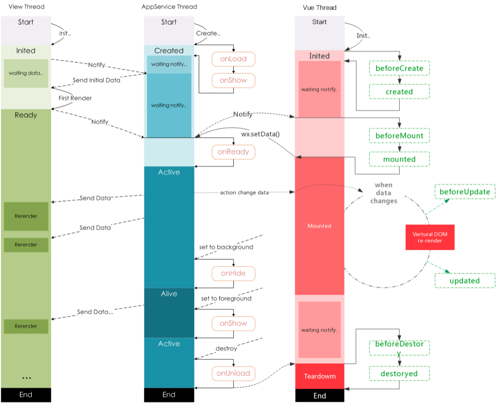

# 页面生命周期

老司机一眼就可以看出，这个是在[微信官方文档|页面生命周期](https://developers.weixin.qq.com/miniprogram/dev/framework/app-service/page.html#%E7%94%9F%E5%91%BD%E5%91%A8%E6%9C%9F)基础上修改的。

对！我们就是在小程序框架之上执行 Vue 的 runtime，管理项目的 dom，在合适的生命周期中执行 vue 的 hooks。