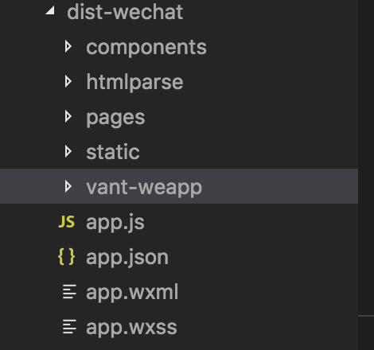
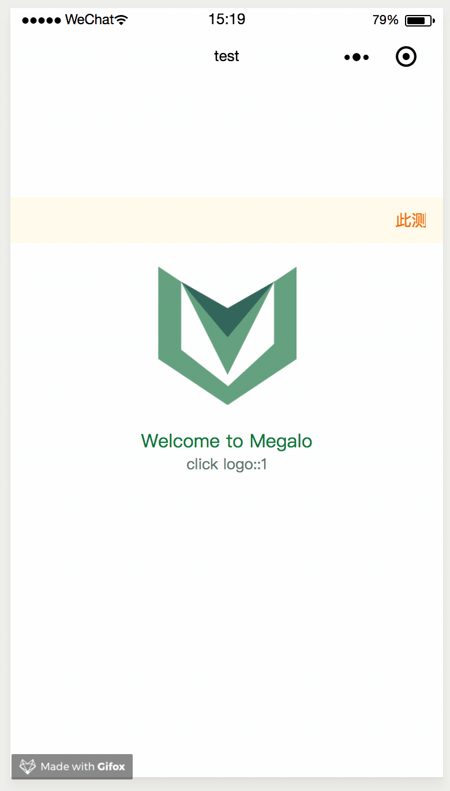

# 代码复用

## 标准 vue 工程转移

megalo 利用小程序的 template 取代了标准 vue 项目的 dom 操作，所以，理论下，未使用浏览器特有 API 和 router 的项目基本都是可以使用 megalo 转译成小程序包

## 同构微信、alipay、智能小程序

megalo 替开发者“基本”抹平微信、alipay 和百度智能小程序的语法差异，开发者可以一键同构其他平台的小程序包。

```
# 微信小程序
$ npm run dev:wechat

# 支付宝小程序
$ npm run dev:alipay

# 百度智能小程序
$ npm run dev:swan
```

我借用社区里 weex demo，[yanxuan-weex-demo](https://github.com/zwwill/yanxuan-weex-demo)，进行稍微的修改即可同构出微信、alipay 和百度智能小程序的代码包，效果如下


    关于 weex 代码的复用，后期我们调研同步生成 weex bundle 的可行性

## 第三方组件库

关于第三方的组件库或小程序组件库，同样的在不涉及主动 dom 操作的，“理论上”都是可以使用的。不过“坑”肯定是存在的。

以 [vant-weapp](https://youzan.github.io/vant-weapp/) 的使用方式为例，谨以此为例不代表官方推荐

只需将源码 clone 到构建后的微信包【dist-wechat】里，然后在 json 文件中引入按钮对应的自定义组件即可



```js
// hello.js
import App from './hello'
import Vue from 'vue'
const app = new Vue(App)
app.$mount()

export default {
    config: {
        "usingComponents": {
            "van-notice-bar": "/vant-weapp/dist/notice-bar/index"
        }
    }
}
```

```html
<!-- hello.vue -->
<template>
  <div class="app">
    <van-notice-bar
      text="此测试组件为引入的第三方组件库 Vant Weapp................"
    />
    <!-- unimportant code -->
  </div>
</template>
```




