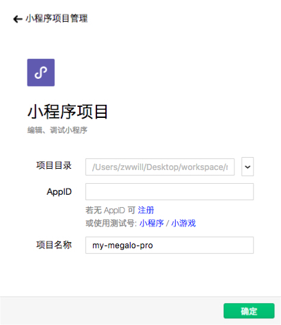
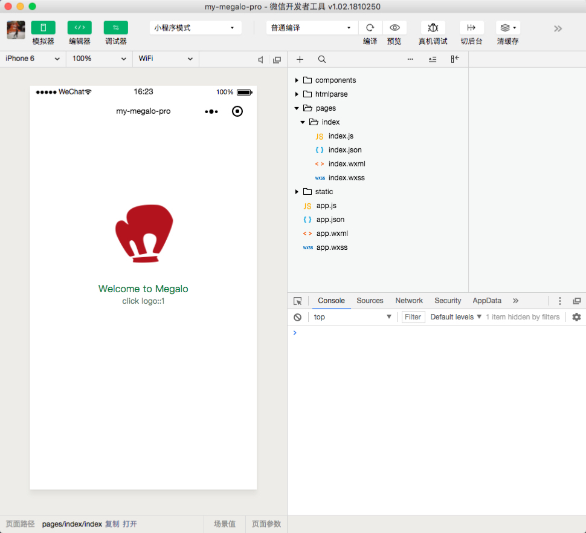
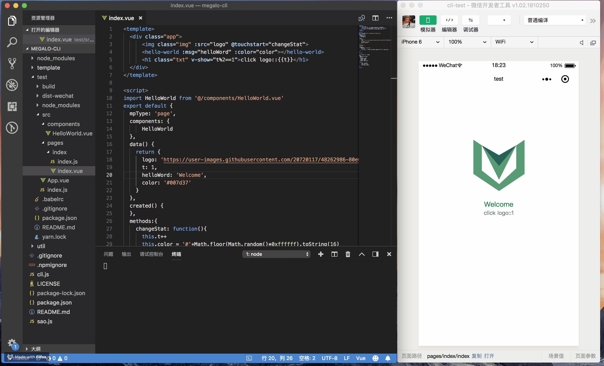

# 快速上手

## 安装 CLI

```shell
$ npm install -g @megalo/cli
# 需要管理员权限 
```

如果安装失败或者过慢，可以尝试切换 [taobao 源](http://npm.taobao.org/)

```shell
$ npm set registry https://registry.npm.taobao.org/
```

## 创建 Megalo 工程

```shell
$ megalo my-megalo-pro

# 或者在已有目录下初始化

$ mkdir my-megalo-pro
$ cd my-megalo-pro
$ megalo
```

## 构建小程序包

```shell
# 微信小程序
$ npm run dev:wechat

# 支付宝小程序
$ npm run dev:alipay

# 百度智能小程序
$ npm run dev:swan
```

> 构建结束会在根目录生成相应的小程序包，`/dist-wechat`、`/dist-alipay`、`/dist-swan`，且 watch 文件变化进行热更

## 小程序开发工具

所有的执行效果均在小程序的[开发工具](https://developers.weixin.qq.com/miniprogram/dev/devtools/devtools.html)中预览、调试

[点击此处下载最新版](https://developers.weixin.qq.com/miniprogram/dev/devtools/download.html)


## 调试

开启微信开发者工具，新建小程序项目

 

将项目目录指向 `/dist-wechat`，选择【测试号|小程序】即可执行。

实战需要使用合法的 AppID，[*AppID 获取方式*](https://developers.weixin.qq.com/miniprogram/dev/#%E7%94%B3%E8%AF%B7%E5%B8%90%E5%8F%B7)



调试的姿势请看[官方文档|小程序调试](https://developers.weixin.qq.com/miniprogram/dev/devtools/debug.html)。

## 页面预览

支持实时刷新



### webpack 配置可扩充

megalo cli 可用于快速构建工程，仅仅是一个可落地项目的开始，为了便于开发者扩充，初始项目功能较为单一。

如果你需要对工程结构进行扩充，DIY 之前你需要了解，我们对基础的 webapck 配置做了哪些修改 [webpack 配置](config/webpack)。
